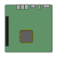

# PCIe templates

Here are my KiCad templates for motherboards
They are standard sizes based on "ATX Specification v2.2" and "Thin Mini-ITX Based PC System Design Guide rev 1.2" documents

These templates are distributed in the hope that they will be useful, but **WITHOUT ANY WARRANTY**

All files availaible under Creative Commons attribution. cc-by [dbozec](https://github.com/dbozec)

